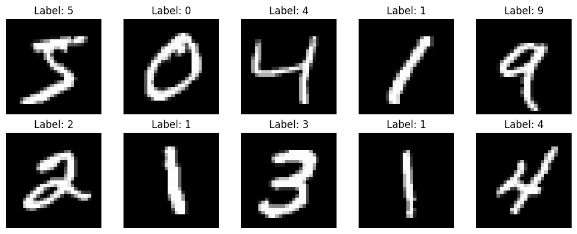

# Custom-ViT-Visual-Transformer

# Vision Transformer (ViT)

This repository contains the code for training a Vision Transformer (ViT) model using the MNIST dataset. The ViT model is implemented using PyTorch and is trained to classify handwritten digits. 
MNIST contains 60,000 handwritten numbers for training and 10,000 handwritten numbers for testing. Custom ViT efficiently achieved an impressive 90% accuracy in only 30 epochs.

# Example of Data

## Visual Transformer description

Visual transformers, also known as vision transformers or ViTs, are a type of deep learning model specifically designed for image recognition tasks. They are inspired by the success of transformers in natural language processing and have shown promising results in various computer vision tasks.

Traditional convolutional neural networks (CNNs) have been the dominant architecture for image classification tasks. However, transformers have emerged as a powerful alternative that can capture long-range dependencies and attend to different parts of the image simultaneously.

The key idea behind visual transformers is to treat an image as a sequence of patches, where each patch represents a local region of the image. These patches are then flattened and fed as input to the transformer model. By representing the image as a sequence, visual transformers can leverage the self-attention mechanism present in transformers to capture relationships between different patches.

The architecture of a visual transformer typically consists of an initial embedding layer, a transformer encoder, and a classification head. The embedding layer converts the input image patches into a higher-dimensional feature representation. The transformer encoder consists of multiple self-attention layers and feed-forward neural networks, enabling the model to capture global and local relationships within the image. Finally, the classification head takes the output of the transformer encoder and performs the final classification based on the task at hand.

Training visual transformers usually involves a large labeled dataset, such as ImageNet, and the use of techniques like supervised fine-tuning. The models are trained with a combination of image classification loss and regularization methods to generalize well to unseen images.

One notable advantage of visual transformers is their ability to handle images of varying sizes, as the image patches can be resized to a fixed size before being processed by the transformer. Additionally, visual transformers have shown good transfer learning capabilities, where pre-trained models on large-scale datasets can be fine-tuned for specific tasks with limited labeled data.

While visual transformers have achieved impressive results in image classification, they may not be as efficient as CNNs for tasks like object detection or segmentation, which require dense spatial information. However, ongoing research aims to improve the performance and efficiency of visual transformers in these areas.

In summary, visual transformers are a recent development in computer vision that leverage the transformer architecture to capture relationships and dependencies in images. They have shown great potential in image classification tasks and continue to be an active area of research in the field of deep learning.

## Prerequisites

Before running the code, make sure you have the following dependencies installed:

- Python (3.6 or higher)
- PyTorch (1.8.1 or higher)
- NumPy (1.19.5 or higher)

# Usage

Clone the repository:
git clone https://github.com/your_username/vision-transformer.git
cd vision-transformer

Run the script:
python main.py

# Code Explanation
The code is structured as follows:

* The create_patches function is used to split the input images into patches for processing by the ViT model.
* The MultiHeadSelfAttention class implements the multi-head self-attention mechanism used in the ViT model.
* The ViTBlock class defines a single block of the ViT model, which consists of a multi-head self-attention layer and a feed-forward neural network.
* The VisionTransformer class defines the complete ViT model, including multiple ViT blocks.
* The get_positional_embeddings function generates positional embeddings used in the ViT model.
* The data_augmentation function applies data augmentation techniques to the input images.
* The train function performs the training loop, including forward and backward passes, optimization, and evaluation.
* The main script loads the MNIST dataset, creates data loaders, initializes the ViT model, defines the loss function and optimizer, and trains the model.

# Output
The training process produces the following output:

* Epoch 1/30, Train Loss: 2.1635, Test Loss: 2.0296, Accuracy: 0.4228
* Epoch 2/30, Train Loss: 2.0531, Test Loss: 1.9152, Accuracy: 0.5475
...
* Epoch 29/30, Train Loss: 1.6283, Test Loss: 1.5587, Accuracy: 0.9033
* Epoch 30/30, Train Loss: 1.6282, Test Loss: 1.5587, Accuracy: 0.9035

The output shows the training progress over multiple epochs. For each epoch, it displays the training loss, test loss, and accuracy 
